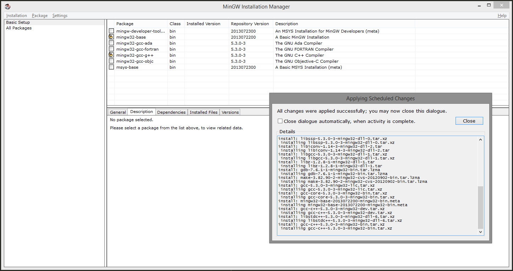

# Reconstruction du projet

Le but de cette documentation est de décrire les actions à effectuer pour compiler le code source et construire les fichiers du dessin animé pru-pra-prok. Elle permet de reproduire à partir de zéro l'ensemble du contenu du répertoire `git/pru-pra-prok/movies/pru-pra-prok_episode_2`.

(Pour l'instant, ce répertoire n'est pas présent dans le repository, mais ça va venir).

À l'origine, le moteur de dessin animé avait été codé et compilé avec l'environnement de développement "DEV-CPP". Le code a ensuite été adapté pour qu'il soit recompilable avec MinGW, qui est un outil plus léger.

## MinGW32

La documentation officielle à ce sujet est ici : [http://mingw.org/wiki/Getting_Started](http://mingw.org/wiki/Getting_Started).

### Installation

Télécharger le fichier `mingw-get-setup.exe` à partir de l'url [https://sourceforge.net/projects/mingw/files/latest/download](https://sourceforge.net/projects/mingw/files/latest/download).

La version actuelle de ce fichier date du 2017-03-09.
La version indiquée lors de l'installation est : 0.6.2-beta-20131004-1

Exécuter le fichier téléchargé.

Cliquer sur Install

Il est fortement conseillé de laisser le répertoire d'installation par défaut : `C:\MinGW`. La doc déconseille fortement de choisir un nom de répertoire avec des espaces.

Cocher "also install support for the graphical user interface". (c'est peut-être pas nécessaire, mais tant qu'à faire...)

Concernant les autres cases à cocher et les radios-boutons (just for me / all users, shortcut in start menu, shortcut on the desktop), on peut laisser comme on veut.

Cliquer sur Continue

Log obtenu :

    mingw-get: *** INFO *** setup: unpacking mingw-get-0.6.2-mingw32-beta-20131004-1-bin.tar.xz
    mingw-get: *** INFO *** setup: unpacking mingw-get-0.6.2-mingw32-beta-20131004-1-gui.tar.xz
    mingw-get: *** INFO *** setup: unpacking mingw-get-0.6.2-mingw32-beta-20131004-1-lic.tar.xz
    mingw-get: *** INFO *** setup: unpacking mingw-get-setup-0.6.2-mingw32-beta-20131004-1-dll.tar.xz
    mingw-get: *** INFO *** setup: unpacking mingw-get-setup-0.6.2-mingw32-beta-20131004-1-xml.tar.xz
    mingw-get: *** INFO *** setup: updating installation database
    mingw-get: *** INFO *** setup: register mingw-get-0.6.2-mingw32-beta-20131004-1-bin.tar.xz
    mingw-get: *** INFO *** setup: register mingw-get-0.6.2-mingw32-beta-20131004-1-gui.tar.xz
    mingw-get: *** INFO *** setup: register mingw-get-0.6.2-mingw32-beta-20131004-1-lic.tar.xz
    mingw-get: *** INFO *** setup: installation database updated

Une nouvelle fenêtre s'ouvre, permettant de sélectionner les package à installer.

Dans la partie gauche de la fenêtre, sélectionner "Basic Setup" (C'est le choix par défaut).

Cocher le package `mingw32-base`. Un menu contextuel s'ouvre. Sélectionner l'option "mark for installation"
Même opération avec le package `mingw32-gcc-g++`.

Dans le menu principal de la fenêtre, cliquer sur l'option "Installation / Apply changes".

Une nouvelle fenêtre s'ouvre, listant les packages qui seront installés :

    libpthreadgc-2.10-mingw32-pre-20160821-1-dll-3.tar.xz
    libgmp-5.1.2-1-mingw32-dll-10.tar
    libmpfr-3.1.2-2-mingw32-dll-4.tar
    libintl-0.18.3.2-2-mingw32-dll-8.tar.xz
    mingwrt-5.0-mingw32-dll.tar.xz
    w32api-5.0-mingw32-dev.tar.xz
    mingwrt-5.0-mingw32-dev.tar.xz
    binutils-2.25.1-1-mingw32-bin.tar.xz
    libmpc-1.0.2-mingw32-dll-3.tar.xz
    libquadmath-5.3.0-3-mingw32-dll-0.tar.xz
    libatomic-5.3.0-3-mingw32-dll-1.tar.xz
    libpthreadgc-2.10-mingw32-pre-20160821-1-dev.tar.xz
    libgomp-5.3.0-3-mingw32-dll-1.tar.xz
    libssp-5.3.0-3-mingw32-dll-0.tar.xz
    libiconv-1.14-3-mingw32-dll-2.tar
    libgcc-5.3.0-3-mingw32-dll-1.tar.xz
    libz-1.2.8-1-mingw32-dll-1.tar
    gdb-7.6.1-1-mingw32-bin.tar.lzma
    make-3.82.90-2-mingw32-cvs-20120902-bin.tar.lzma
    gcc-5.3.0-3-mingw32-lic.tar.xz
    gcc-core-5.3.0-3-mingw32-bin.tar.xz
    mingw32-base-2013072200-mingw32-bin.meta
    gcc-c++-5.3.0-3-mingw32-dev.tar.xz
    libstdc++-5.3.0-3-mingw32-dll-6.tar.xz
    gcc-c++-5.3.0-3-mingw32-bin.tar.xz

(La fenêtre indique également qu'aucun package ne sera supprimé, ni aucun upgradé)

Cliquer sur Apply pour déclencher l'installation des packages.

Log obtenu :

    install: libpthreadgc-2.10-mingw32-pre-20160821-1-dll-3.tar.xz
     installing libpthreadgc-2.10-mingw32-pre-20160821-1-dll-3.tar.xz
    install: libgmp-5.1.2-1-mingw32-dll-10.tar
     installing libgmp-5.1.2-1-mingw32-dll-10.tar
    install: libmpfr-3.1.2-2-mingw32-dll-4.tar
     installing libmpfr-3.1.2-2-mingw32-dll-4.tar
    install: libintl-0.18.3.2-2-mingw32-dll-8.tar.xz
     installing libintl-0.18.3.2-2-mingw32-dll-8.tar.xz
    install: mingwrt-5.0-mingw32-dll.tar.xz
     installing mingwrt-5.0-mingw32-dll.tar.xz
    install: w32api-5.0-mingw32-dev.tar.xz
     installing w32api-5.0-mingw32-dev.tar.xz
    install: mingwrt-5.0-mingw32-dev.tar.xz
     installing mingwrt-5.0-mingw32-dev.tar.xz
    install: binutils-2.25.1-1-mingw32-bin.tar.xz
     installing binutils-2.25.1-1-mingw32-bin.tar.xz
    install: libmpc-1.0.2-mingw32-dll-3.tar.xz
     installing libmpc-1.0.2-mingw32-dll-3.tar.xz
    install: libquadmath-5.3.0-3-mingw32-dll-0.tar.xz
     installing libquadmath-5.3.0-3-mingw32-dll-0.tar.xz
    install: libatomic-5.3.0-3-mingw32-dll-1.tar.xz
     installing libatomic-5.3.0-3-mingw32-dll-1.tar.xz
    install: libpthreadgc-2.10-mingw32-pre-20160821-1-dev.tar.xz
     installing libpthreadgc-2.10-mingw32-pre-20160821-1-dev.tar.xz
    install: libgomp-5.3.0-3-mingw32-dll-1.tar.xz
     installing libgomp-5.3.0-3-mingw32-dll-1.tar.xz
    install: libssp-5.3.0-3-mingw32-dll-0.tar.xz
     installing libssp-5.3.0-3-mingw32-dll-0.tar.xz
    install: libiconv-1.14-3-mingw32-dll-2.tar
     installing libiconv-1.14-3-mingw32-dll-2.tar
    install: libgcc-5.3.0-3-mingw32-dll-1.tar.xz
     installing libgcc-5.3.0-3-mingw32-dll-1.tar.xz
    install: libz-1.2.8-1-mingw32-dll-1.tar
     installing libz-1.2.8-1-mingw32-dll-1.tar
    install: gdb-7.6.1-1-mingw32-bin.tar.lzma
     installing gdb-7.6.1-1-mingw32-bin.tar.lzma
    install: make-3.82.90-2-mingw32-cvs-20120902-bin.tar.lzma
     installing make-3.82.90-2-mingw32-cvs-20120902-bin.tar.lzma
    install: gcc-5.3.0-3-mingw32-lic.tar.xz
     installing gcc-5.3.0-3-mingw32-lic.tar.xz
    install: gcc-core-5.3.0-3-mingw32-bin.tar.xz
     installing gcc-core-5.3.0-3-mingw32-bin.tar.xz
    install: mingw32-base-2013072200-mingw32-bin.meta
     installing mingw32-base-2013072200-mingw32-bin.meta
    install: gcc-c++-5.3.0-3-mingw32-dev.tar.xz
     installing gcc-c++-5.3.0-3-mingw32-dev.tar.xz
    install: libstdc++-5.3.0-3-mingw32-dll-6.tar.xz
     installing libstdc++-5.3.0-3-mingw32-dll-6.tar.xz
    install: gcc-c++-5.3.0-3-mingw32-bin.tar.xz
     installing gcc-c++-5.3.0-3-mingw32-bin.tar.xz

Dans le menu principal de la fenêtre, cliquer sur l'option "Installation / Quit".

### Vérification de l'installation

Ouvrir une console de commande Windows (Options "exécuter" dans le menu démarrer, saisir "cmd" dans la fenêtre).

Aller dans le répertoire d'installation de MinGW (si vous n'avez pas sélectionné le répertoire par défaut, adaptez la commande suivante).

    C:\Users\Recher>cd C:\MinGW

Aller dans le sous-répertoire "bin" et afficher le numéro de version de g++.

    c:\MinGW>cd bin

    c:\MinGW\bin>g++.exe --version
    g++.exe (GCC) 5.3.0
    Copyright (C) 2015 Free Software Foundation, Inc.
    This is free software; see the source for copying conditions.  There is NO
    warranty; not even for MERCHANTABILITY or FITNESS FOR A PARTICULAR PURPOSE.

Si vous avez une version plus récente que 5.3.0, la suite des actions décrites dans cette documentation devrait fonctionner de la même manière.
