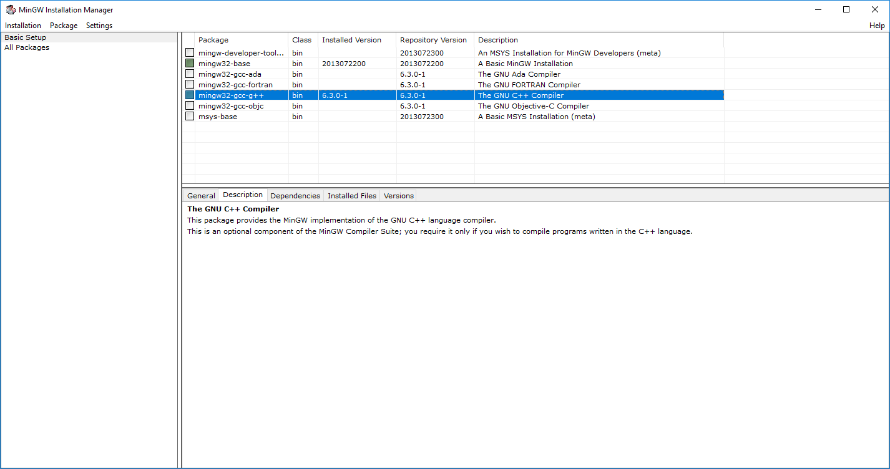

# Reconstruction du projet

Le but de cette documentation est de décrire les actions à effectuer pour compiler le code source et construire les fichiers du dessin animé pru-pra-prok. Elle permet de reproduire à partir de zéro l'ensemble du contenu du répertoire [repo_git/movies/pru-pra-prok_episode_2](../movies/pru-pra-prok_episode_2).

(Pour l'instant, ce répertoire n'est pas présent dans le repository, mais ça va venir).

Tous les chemins indiquant un fichier ou un répertoire de ce repository sont préfixés par `repo_git/`. Lorsque c'est possible, ces chemins sont sous forme d'une url, permettant d'accéder directement à l'élément concerné.

À l'origine, le moteur de dessin animé avait été codé et compilé avec l'environnement de développement "DEV-CPP". Le code a ensuite été adapté pour qu'il soit recompilable avec MinGW, qui est un outil plus léger.

## MinGW32

La documentation officielle à ce sujet est ici : [http://mingw.org/wiki/Getting_Started](http://mingw.org/wiki/Getting_Started).

### Installation

Télécharger le fichier `mingw-get-setup.exe` à partir de l'url [https://sourceforge.net/projects/mingw/files/latest/download](https://sourceforge.net/projects/mingw/files/latest/download).

La version indiquée lors de l'installation est : 0.6.2-beta-20131004-1

Exécuter le fichier téléchargé.

Cliquer sur Install

Il est fortement conseillé de laisser le répertoire d'installation par défaut : `C:\MinGW`. La doc déconseille fortement de choisir un nom de répertoire avec des espaces.

Cocher "also install support for the graphical user interface". (c'est peut-être pas nécessaire, mais tant qu'à faire...)

Concernant les autres cases à cocher et les radios-boutons (just for me / all users, shortcut in start menu, shortcut on the desktop), on peut laisser comme on veut.

Cliquer sur Continue

Log obtenu :

    mingw-get: *** INFO *** setup: unpacking mingw-get-0.6.2-mingw32-beta-20131004-1-bin.tar.xz
    mingw-get: *** INFO *** setup: unpacking mingw-get-0.6.2-mingw32-beta-20131004-1-gui.tar.xz
    mingw-get: *** INFO *** setup: unpacking mingw-get-0.6.2-mingw32-beta-20131004-1-lic.tar.xz
    mingw-get: *** INFO *** setup: unpacking mingw-get-setup-0.6.2-mingw32-beta-20131004-1-dll.tar.xz
    mingw-get: *** INFO *** setup: unpacking mingw-get-setup-0.6.2-mingw32-beta-20131004-1-xml.tar.xz
    mingw-get: *** INFO *** setup: updating installation database
    mingw-get: *** INFO *** setup: register mingw-get-0.6.2-mingw32-beta-20131004-1-bin.tar.xz
    mingw-get: *** INFO *** setup: register mingw-get-0.6.2-mingw32-beta-20131004-1-gui.tar.xz
    mingw-get: *** INFO *** setup: register mingw-get-0.6.2-mingw32-beta-20131004-1-lic.tar.xz
    mingw-get: *** INFO *** setup: installation database updated

Une nouvelle fenêtre s'ouvre, permettant de sélectionner les package à installer.

Dans la partie gauche de la fenêtre, sélectionner "Basic Setup" (C'est le choix par défaut).

Cocher le package `mingw32-base`. Un menu contextuel s'ouvre. Sélectionner l'option "mark for installation"
Même opération avec le package `mingw32-gcc-g++`.

Dans le menu principal de la fenêtre, cliquer sur l'option "Installation / Apply changes".

Une nouvelle fenêtre s'ouvre, listant les packages qui seront installés :

    libiconv-1.14-3-mingw32-dll-2.tar
    libpthreadgc-2.10-mingw32-pre-20160821-1-dll-3.tar.xz
    mingw32-libgomp-deps-5.3.0-mingw32-dll.meta
    libgcc-6.3.0-1-mingw32-dll-1.tar.xz
    libintl-0.18.3.2-2-mingw32-dll-8.tar.xz
    mingwrt-5.0.1-mingw32-dll.tar.xz
    libgmp-6.1.2-2-mingw32-dll-10.tar.xz
    libmpfr-3.1.5-1-mingw32-dll-4.tar.xz
    libmpc-1.0.3-1-mingw32-dll-3.tar.xz
    libisl-0.18-1-mingw32-dll-15.tar.xz
    gcc-core-4.8.2-mingw32-dev.tar.meta
    mingw32-gcc-core-deps-6.3.0-1-mingw32-dll.meta
    libquadmath-6.3.0-1-mingw32-dll-0.tar.xz
    libgomp-6.3.0-1-mingw32-dll-1.tar.xz
    libssp-6.3.0-1-mingw32-dll-0.tar.xz
    libmingwex-5.0.1-mingw32-dll-0.tar.xz
    w32api-5.0.1-mingw32-dev.tar.xz
    mingwrt-5.0.1-mingw32-dev.tar.xz
    binutils-2.28-1-mingw32-bin.tar.xz
    libatomic-6.3.0-1-mingw32-dll-1.tar.xz
    libz-1.2.8-1-mingw32-dll-1.tar
    gdb-7.6.1-1-mingw32-bin.tar.lzma
    make-3.82.90-2-mingw32-cvs-20120902-bin.tar.lzma
    gcc-6.3.0-1-mingw32-lic.tar.xz
    libstdc++-6.3.0-1-mingw32-dll-6.tar.xz
    gcc-core-6.3.0-1-mingw32-bin.tar.xz
    mingw32-base-2013072200-mingw32-bin.meta
    gcc-c++-4.8.2-mingw32-dev.tar.meta
    gcc-c++-6.3.0-1-mingw32-bin.tar.xz

(La fenêtre indique également qu'aucun package ne sera supprimé, ni aucun upgradé)

Cliquer sur Apply pour déclencher l'installation des packages.

Si votre connexion internet est de mauvaise qualité, certains packages ne seront pas téléchargés, et vous aurez un message d'avertissement. Ensuite, l'installeur essaye quand même d'installer ce qu'il a pu télécharger. Mais ça fait des erreurs. Puis quand on refait le bouton "Apply changes", il retélécharge et re-installe, mais écrit des messages d'erreur pour tout ce qui a déjà été téléchargé. C'est contre-intuitif, stupide et anxiogène, mais à priori, à la fin, tout est correctement installé.

La première installation a été effectué le 2017-05-04, avec la version de gcc 5.3.0. Tout s'est bien passé du premier coup.

[Lien vers le log obtenu.](install_mingw32/log_install_5.3.0.txt)

[Lien vers le screenshot](install_mingw32/screenshot_005_installation_packages.png)

La seconde installation a été effectué le 2017-12-09, avec la version de gcc 6.3.0. Ça a merdouillé.

[Lien vers le log obtenu.](install_mingw32/log_install_6.3.0.txt)

[Lien vers le screenshot](install_mingw32/screenshot_0055_download_fail.png)

Bref, à la fin, on devrait avoir quelque chose comme ça :

Dans le menu principal de la fenêtre, cliquer sur l'option "Installation / Quit".

### Vérification

#### Présence du compilateur

Ouvrir une console de commande Windows (Options "exécuter" dans le menu démarrer, saisir "cmd" dans la fenêtre).

Aller dans le répertoire d'installation de MinGW (si vous n'avez pas sélectionné le répertoire par défaut, adaptez la commande suivante).

    cd C:\MinGW

Aller dans le sous-répertoire "bin" et afficher le numéro de version de g++.

    cd bin

    g++.exe --version

Résultat attendu :

    g++.exe (MinGW.org GCC-6.3.0-1) 6.3.0
    Copyright (C) 2016 Free Software Foundation, Inc.
    This is free software; see the source for copying conditions.  There is NO
    warranty; not even for MERCHANTABILITY or FITNESS FOR A PARTICULAR PURPOSE.

Si vous avez une version plus récente que 6.3.0, la suite des actions décrites dans cette documentation devrait fonctionner de la même manière.

#### Compilation d'un code simple

La documentation de l'outil MinGW indique que le répertoire dans lequel il a été installé doit être ajouté dans le PATH de Windows. C'est fort louable, mais vous n'avez peut-être pas envie de modifier la config de votre système juste pour recompiler des trucs. On va donc modifier le PATH, mais temporairement.

Ouvrir une console de commande Windows (ou reprendre celle du chapitre précédent).

Exécuter la commande suivante :

    set path=%path%;C:\MinGW\bin

Pour vérifier que le path a bien été modifié, exécuter la commande `echo %path%`. Le texte renvoyé doit se terminer par `;C:\MinGW\bin`.

Si la console de commande est fermée, et que les actions de ce test sont reprises à partir d'une autre console, il faut re-exécuter la commande `set path=%path%;C:\MinGW\bin`.

Aller dans le répertoire du repository. (Pour l'exemple, on suppose que vous avez cloné ce repository sur votre disque, à l'emplacement `C:\repo_git\pru-pra-prok`)

    cd C:\repo_git\pru-pra-prok
    cd doc\test_mingw32

Lancer la compilation.

    g++.exe -c test_mingw.cpp -o test_mingw.o

Vérifier qu'un fichier `test_mingw.o` a été créé dans le répertoire courant.

Lancer l'édition de lien.

    g++.exe test_mingw.o -o test_mingw.exe

Vérifier qu'un fichier `test_mingw.exe` a été créé dans le répertoire courant.

Dans le répertoire `C:\MinGW\bin` se trouve 2 fichiers : `libgcc_s_dw2-1.dll` et `libstdc++-6.dll`. Copier ces fichiers dans le répertoire contenant `test_mingw.exe`.

    copy C:\MinGW\bin\libgcc_s_dw2-1.dll .
        1 fichier(s) copié(s).

    copy C:\MinGW\bin\libstdc++-6.dll .
        1 fichier(s) copié(s).

L'exécutable de test peut maintenant être lancé. Mais les informations envoyées sur la sortie standard ne seront pas écrites dans la console (je ne sais pas pourquoi). Il faut donc les rediriger vers un fichier.

Exécuter la commande suivante :

    test_mingw.exe > stdout.txt

Si vous utilisez l'antivirus avast, il est possible que celui-ci émette un message d'avertissement car `test_mingw.exe` est un exécutable qui lui est inconnu. Son lancement prendra simplement quelques secondes de plus que prévu, mais ne devrait pas poser de problème.

Vérifier qu'un fichier `stdout.txt` a été créé dans le répertoire courant, et que ce fichier contient une seule ligne, avec le texte `Test MINGW. OK.` suivi d'un saut de ligne.

#### Compilation avec un makefile

Toujours dans une console de commande, exécuter un `make` sur le fichier `makefile`.

    cd C:\repo_git\pru-pra-prok
    cd doc\test_mingw32

    mingw32-make.exe

Résultat attendu :

    g++.exe -c test_mingw_2.cpp -o test_mingw_2.o
    g++.exe test_mingw_2.o -o test_mingw_2.exe

Cette commande doit avoir créé un fichier `test_mingw_2.o` et un fichier `test_mingw_2.exe` dans le répertoire courant.

Si ça n'a pas encore été fait, copier les dll `libgcc_s_dw2-1.dll` et `libstdc++-6.dll` comme décrit dans le chapitre précédent.

Lancer l'exécutable de test (Avast va peut-être râler à nouveau) :

    test_mingw_2.exe > stdout_2.txt

Vérifier qu'un fichier `stdout_2.txt` a été créé dans le répertoire courant, et que ce fichier contient une seule ligne, avec le texte `Test MINGW. OK. 2.` suivi d'un saut de ligne.

## Récupération des librairies

Ce chapitre permet de reconstruire le contenu du répertoire [repo_git/pru-pra-prok/code/libs_includes](../code/libs_includes).

Le moteur de dessin animé utilise zlib, la librairie SDL, et des librairies associées à la SDL. La SDL sert à exploiter divers "médias" d'un ordinateur : sons, écran, clavier, souris, ...

Il existe deux versions principales de la SDL : 1.2.x et 2.0.x.

Dans sa version originale, le moteur utilisait les librairies suivantes :

 - SDL-1.2.7
 - SDL_mixer-1.2.5
 - SDL_image-1.2.3
 - zlib121-dll

La version actuelle utilise des librairies plus récentes :

 - SDL-1.2.15
 - SDL_image-1.2.12
 - SDL_mixer-1.2.12
 - zlib-1.2.3

La recompilation avec des librairies SDL 2.0.x n'a pas été testée. À priori, ça ne marchera pas, car ce n'est pas rétro-compatble (Semantic Versioning).

Attention, quel que soit l'endroit où se trouve le repository sur votre disque dur, les librairies doivent être placées dans le répertoire `repo_git/pru-pra-prok/code/libs_includes`. Sinon, le fichier makefile du moteur de dessin animé ne pourra pas les retrouver.

### SDL

Page de téléchargement de la librairie : [https://www.libsdl.org/download-1.2.php](https://www.libsdl.org/download-1.2.php)

Le fichier à télécharger se trouve dans le paragraphe : Development Libraries / Win32 / MingW32.

Lien direct de la version 1.2.x actuelle : [https://www.libsdl.org/release/SDL-devel-1.2.15-mingw32.tar.gz](https://www.libsdl.org/release/SDL-devel-1.2.15-mingw32.tar.gz)

Ce lien permet de récupérer un fichier `SDL-devel-1.2.15-mingw32.tar.gz`.

(Les fichiers .tar.gz sont des fichiers compressés, un peu come des .zip. Ils peuvent être décompressé à l'aide d'utilitaires gratuits comme [7-zip](http://www.7-zip.org/)).

Décompresser ce fichier dans [repo_git/pru-pra-prok/code/libs_includes/SDL-devel-1.2.15-mingw32](../code/libs_includes/SDL-devel-1.2.15-mingw32).

### SDL_image

Page de téléchargement de la librairie : [https://www.libsdl.org/projects/SDL_image/release-1.2.html](https://www.libsdl.org/projects/SDL_image/release-1.2.html). (Attention, la page est moche, c'est normal).

Le fichier à télécharger se trouve dans le paragraphe : Binary / Windows / SDL_image-devel-xxxxx.

Lien direct de la version 1.2.x actuelle : [https://www.libsdl.org/projects/SDL_image/release/SDL_image-devel-1.2.12-VC.zip](https://www.libsdl.org/projects/SDL_image/release/SDL_image-devel-1.2.12-VC.zip)

Ce lien permet de récupérer un fichier `SDL_image-devel-1.2.12-VC.zip`.

Décompresser ce fichier dans [repo_git/pru-pra-prok/code/libs_includes/SDL_image-devel-1.2.12-VC](../code/libs_includes/SDL_image-devel-1.2.12-VC).

### SDL_mixer

Page de téléchargement de la librairie : [https://www.libsdl.org/projects/SDL_mixer/release-1.2.html](https://www.libsdl.org/projects/SDL_mixer/release-1.2.html). (Attention, c'est moche pareil que SDL_image).

Le fichier à télécharger se trouve dans le paragraphe : Binary / Windows / SDL_mixer-devel-xxxxx.

Lien direct de la version 1.2.x actuelle : [https://www.libsdl.org/projects/SDL_mixer/release/SDL_mixer-devel-1.2.12-VC.zip](https://www.libsdl.org/projects/SDL_mixer/release/SDL_mixer-devel-1.2.12-VC.zip)

Ce lien permet de récupérer un fichier `SDL_mixer-devel-1.2.12-VC.zip`.

Décompresser ce fichier dans [repo_git/pru-pra-prok/code/libs_includes/SDL_mixer-devel-1.2.12-VC](../code/libs_includes/SDL_mixer-devel-1.2.12-VC).

### zlib

Site officiel : [http://www.zlib.net/](http://www.zlib.net/).

Cette librairie est utilisée par beaucoup de logiciels, et on peut donc la trouver un peu partout. ce qui nous amène au phénomène qui se produit systématiquement dans ce genre de situation : partout = nul part.

J'ai eu beaucoup de mal à trouver une version de développement de cette librairie, avec les composants qu'on est en droit d'attendre : le fichier de header, la lib et la dll. Le site officiel ne semble pas avoir cela dans sa multitude de lien plus ou moins intéressants et plus ou moins bien rangés.

C'est donc sur ce site [http://xmlsoft.org/sources/win32/](http://xmlsoft.org/sources/win32/) que j'ai trouvé mon bonheur. Pourquoi ici plutôt qu'ailleurs, je n'en sais rien. Toujours est-il qu'on y trouve un lien permettant de récupérer la version 1.2.3 de zlib, avec les composants comme on les connait.

Lien direct de téléchargement : [http://xmlsoft.org/sources/win32/zlib-1.2.3.win32.zip](http://xmlsoft.org/sources/win32/zlib-1.2.3.win32.zip).

Ce lien permet de récupérer un fichier `zlib-1.2.3.win32.zip`.

Décompresser ce fichier dans [repo_git/pru-pra-prok/code/libs_includes/zlib-1.2.3.win32.zip](../code/libs_includes/zlib-1.2.3.win32.zip).

## Moteur de dessin animé

### Recompilation splash.exe

Ce chapitre décrit la méthode pour reconstruire le fichier [repo_git/pru-pra-prok/code/splash/splash.exe](../code/splash/splash.exe). Il s'agit de l'exécutable permettant de visionner les dessins animé. "SPLASH" étant un acronyme de "South Park : L'Abominable Script à Histoire".

Ouvrir une console de commande Windows (ou reprendre celle du chapitre précédent).

Exécuter les commandes suivantes :

Le path si ça n'a pas déjà été fait :

    set path=%path%;C:\MinGW\bin

Aller dans le répertoire "code\splash" du repository.

    cd C:\repo_git\pru-pra-prok
    cd code\splash

Supprimer les binaires précédemment générés (il n'y a pas de "make clean", désolé).

    del splash.exe
    del *.o

Lancer la compilation

    mingw32-make.exe

[Lien vers le log obtenu.](../code/splash/log_compilation.txt)

Beaucoup de fichiers .o ont été créé dans le répertoire courant, ainsi qu'un fichier splash.exe. Il s'agit de l'exécutable permettant de visionner les dessins animés.

### Test avec le film d'exemple

Dans le répertoire `C:\repo_git\pru-pra-prok\movies\example`, copier les fichiers suivants :

 - `C:\MinGW\bin\libgcc_s_dw2-1.dll`
 - `C:\MinGW\bin\libstdc++-6.dll`
 - Tout le contenu de `C:\repo_git\pru-pra-prok\code\libs_includes\SDL-devel-1.2.15-mingw32\SDL-1.2.15\bin`
 - Tout le contenu de `C:\repo_git\pru-pra-prok\code\libs_includes\SDL_mixer-devel-1.2.12-VC\SDL_mixer-1.2.12\lib\x86`
 - Tout le contenu de `C:\repo_git\pru-pra-prok\code\libs_includes\SDL_image-devel-1.2.12-VC\SDL_image-1.2.12\lib\x86`
 - Le fichier `C:\repo_git\pru-pra-prok\code\splash\splash.exe` que vous avez reconstruit au chapitre précédent.

Si vous n'êtes pas parvenu à récupérer/reconstruire tous ces fichiers, prenez ceux de `C:\repo_git\pru-pra-prok\movies\pru-pra-prok_episode_2` (mais pour l'instant ce rep n'est pas le repo.)

Dans une console, exécuter les commandes suivantes (pas besoin d'exécuter la commande `set path=...`)

    cd C:\repo_git\pru-pra-prok
    cd movies\example

    splash.exe example.xml

Avast risque à nouveau de râler, et vous risquez d'avoir une première fenêtre affichant un gros point d'exclamation, ou bien ce message d'erreur :

> impossible de jouer le film.
> Consulter le fichier stderr.txt,
> dans le répertoire du film,
> pour le détail des messages d'erreur.

Il faut attendre un peu, et le film devrait se lancer dans une fenêtre. Vérifiez que le son fonctionne (on entend le corbeau faire "croaaaa-croaaaa").

Vous pouvez également tester le deuxième film d'exemple, avec la commande `splash.exe example_avec_poisson.xml`. Il ressemble beaucoup au premier, mais utilise un fichier d'images et de sons compressés : `C:\repo_git\pru-pra-prok\movies\example\data1.cul`

## Utilitaire concat_files.exe

### Recompilation concat_files.exe

Ce chapitre décrit la méthode pour reconstruire le fichier [repo_git/pru-pra-prok/code/concat_files/concat_files.exe](../code/concat_files/concat_files.exe). Il s'agit de l'exécutable permettant de créer des fichiers compressés au format ".cul".

Les actions décrites dans le chapitre "MinGW32" doivent avoir été préalablement effectuées pour pouvoir réaliser cette recompilation.

Ouvrir une console de commande Windows et exécuter les commandes suivantes :

Le path si ça n'a pas déjà été fait :

    set path=%path%;C:\MinGW\bin

Aller dans le répertoire "code\concat_files" du repository.

    cd C:\repo_git\pru-pra-prok
    cd code\concat_files

Supprimer les binaires précédemment générés (il n'y a pas de "make clean", désolé).

    del concat_files.exe
    del *.o

Lancer la compilation

    mingw32-make.exe

Un fichier main.o a été créé dans le répertoire courant, ainsi qu'un fichier concat_files.exe. Il s'agit de l'exécutable permettant de créer des fichiers compressés

### Test de compression d'un fichier

Installer un utilitaire permettant de compresser des fichiers au format ".gz". Sous Windows, on pourra par exemple prendre [7-zip](http://www.7-zip.org/).

Dans le répertoire `C:\repo_git\pru-pra-prok\movies\example`, copier les fichiers suivants :

 - `C:\MinGW\bin\libgcc_s_dw2-1.dll`
 - `C:\MinGW\bin\libstdc++-6.dll`
 - Le fichier `C:\repo_git\pru-pra-prok\code\concat_files\concat_files.exe` reconstruit au chapitre précédent.

Dans une console, exécuter les commandes suivantes (pas besoin d'exécuter la commande `set path=...`)

    cd C:\repo_git\pru-pra-prok
    cd movies\example

Suppression du fichier compressé existant

    del data1.cul

Recréation du fichier :

    concat_files.exe list_concat.txt

(Avast risque de protester un peu, comme d'habitude).

Log obtenu sur la sortie standard :

    Rassemblement de fichiers vers 'data1.cul'
    ajout de Collines.png   taille : 2551   OK.
    ajout de Poisson.png   taille : 477   OK.
    ajout de Piaf.png   taille : 411   OK.
    ajout de Croa.wav   taille : 11832   OK.
    Fin du rassemblement des fichiers.
    Vous devez maintenant compresser le fichier de sortie au format .gz

Un fichier `data1.cul` a été créé. Compressez-le au format .gz. Supprimer le fichier `data1.cul` existant, et renommer le fichier compressé `data1.cul.gz` en `data1.cul`.

Vous avez recréé le fichier `data1.cul` qui était initialement présent dans le repository.

Pour tester sa validité, exécuter les actions du chapitre "Moteur de dessin animé", puis exécuter la commande `splash.exe example_avec_poisson.xml`. Vous devriez voir le second dessin animé d'exemple.

Vous pouvez retester en supprimant les fichiers .png et .wav de `C:\repo_git\pru-pra-prok\movies\example`, pour vous assurer complètement que la visualisation du dessin animé ne nécessite plus que `data1.cul`.

## Utilitaire extract_files.exe

### Recompilation extract_files.exe

Ce chapitre décrit la méthode pour reconstruire le fichier [repo_git/pru-pra-prok/code/extract_files/extract_files.exe](../code/extract_files/extract_files.exe). Il s'agit de l'exécutable "inverse" de concat_files. Il permet de récupérer les fichiers images et sons stockés dans les fichiers compressés au format ".cul".

Les actions décrites dans le chapitre "MinGW32" doivent avoir été préalablement effectuées pour pouvoir réaliser cette recompilation.

Ouvrir une console de commande Windows et exécuter les commandes suivantes :

Le path si ça n'a pas déjà été fait :

    set path=%path%;C:\MinGW\bin

Aller dans le répertoire "code\extract_files" du repository.

    cd C:\repo_git\pru-pra-prok
    cd code\extract_files

Supprimer les binaires précédemment générés.

    del extract_files.exe
    del *.o

Lancer la compilation

    mingw32-make.exe

Des fichiers *.o ont été créés dans le répertoire courant, ainsi qu'un fichier extract_files.exe. Il s'agit de l'exécutable permettant d'extraire les données des fichiers compressés.

### Test d'extraction

Dans le répertoire `C:\repo_git\pru-pra-prok\movies\example`, copier les fichiers suivants :

 - `C:\MinGW\bin\libgcc_s_dw2-1.dll`
 - `C:\MinGW\bin\libstdc++-6.dll`
 - `C:\repo_git\pru-pra-prok\code\libs_includes\zlib-1.2.3.win32\bin\zlib1.dll`
 - Le fichier `C:\repo_git\pru-pra-prok\code\extract_files\extract_files.exe` reconstruit au chapitre précédent.

Les fichiers `List_ImgSons.zob` et `data1.cul` sont indispensables pour ce test. Tous les autres fichiers de `C:\repo_git\pru-pra-prok\movies\example` peuvent être momentanément déplacés ailleurs, pour vérifier qu'ils ne sont pas nécessaires : *.png, *.wav, *.xml, config.txt, list_concat.txt.

Dans une console, exécuter les commandes suivantes (pas besoin d'exécuter la commande `set path=...`)

    cd C:\repo_git\pru-pra-prok
    cd movies\example

Extraction des fichiers :

    extract_files.exe

(Avast risque de protester un peu, comme d'habitude).

Une nouvelle fenêtre DOS apparaît, indiquant : "Appuyez sur une touche pour continuer". Après l'avoir fait, la fenêtre se ferme automatiquement.

Un répertoire `FilmData` a été créé, contenant les fichiers images et sons qui ont été extraits de `data1.cul`.

## Utilitaire xml_optimizer.exe

### Recompilation xml_optimizer.exe

Ce chapitre décrit la méthode pour reconstruire le fichier [repo_git/pru-pra-prok/code/xml_optimizer/xml_optimizer.exe](../code/xml_optimizer/xml_optimizer.exe). Il s'agit d'un exécutable permettant d'optimiser les fichiers .xml de description de films.

Les actions décrites dans le chapitre "MinGW32" doivent avoir été préalablement effectuées pour pouvoir réaliser cette recompilation.

Ouvrir une console de commande Windows et exécuter les commandes suivantes :

Le path si ça n'a pas déjà été fait :

    set path=%path%;C:\MinGW\bin

Aller dans le répertoire "code\xml_optimizer" du repository.

    cd C:\repo_git\pru-pra-prok
    cd code\xml_optimizer

Supprimer les binaires précédemment générés.

    del xml_optimizer.exe
    del *.o

Lancer la compilation

    mingw32-make.exe

Des fichiers *.o ont été créés dans le répertoire courant, ainsi qu'un fichier xml_optimizer.exe. Il s'agit de l'exécutable permettant d'optimiser les XML.

### Test d'optimisation d'un XML.

Dans le répertoire `C:\repo_git\pru-pra-prok\movies\example`, copier les fichiers suivants :

 - `C:\MinGW\bin\libgcc_s_dw2-1.dll`
 - `C:\MinGW\bin\libstdc++-6.dll`
 - Le fichier `C:\repo_git\pru-pra-prok\code\xml_optimizer\xml_optimizer.exe` reconstruit au chapitre précédent.

Dans une console, exécuter les commandes suivantes (pas besoin d'exécuter la commande `set path=...`)

    cd C:\repo_git\pru-pra-prok
    cd movies\example

Suppression du fichier optimisé existant :

    del example_avec_poisson_optim.xml

Optimisation du fichier `example_avec_poisson.xml` :

    xml_optimizer.exe example_avec_poisson.xml example_avec_poisson_optim.xml

(Avast risque de protester un peu, comme d'habitude).

Une nouvelle fenêtre DOS apparaît, indiquant : "Appuyez sur une touche pour continuer". Après l'avoir fait, la fenêtre se ferme automatiquement.

Le fichier `example_avec_poisson_optim.xml` a été recréé.

L'optimisation n'est pas tout à fait au point, il est nécessaire d'effectuer quelques actions manuelles.

Ouvrir `example_avec_poisson_optim.xml` avec un éditeur de texte.

 - Remplacer la chaîne `a<SPLASH>` par `<SPLASH>`. (Il faut enlever le "a")
 - Remplacer la chaîne `<CompressedFile><Name>b</Name>` par `<CompressedFile><Name>data1.cul</Name>`

Pour tester le fichier optimisé, effectuer les actions du chapitre "Moteur de dessin animé", puis exécuter la commande `splash.exe example_avec_poisson_optim.xml`. Vous devriez à nouveau voir le second dessin animé d'exemple.
